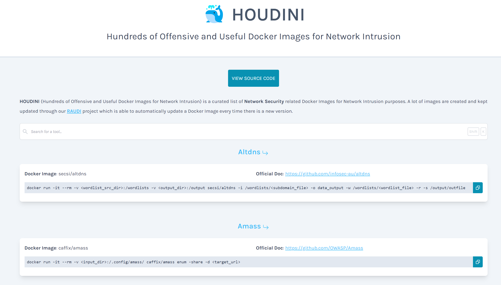
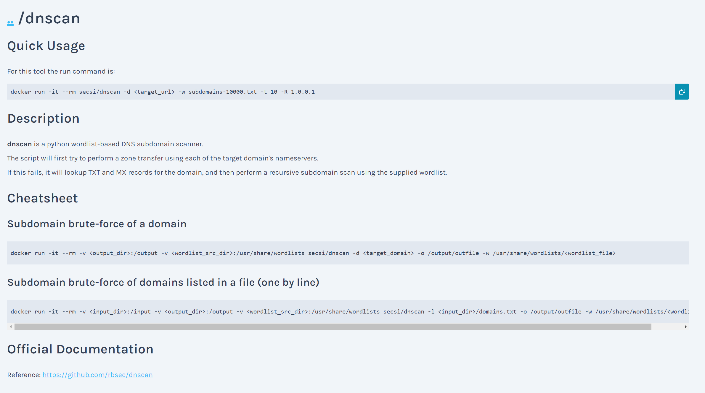
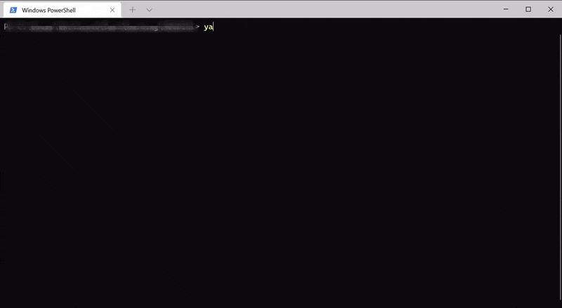

# 🐳 HOUDINI: Hundreds of Offensive and Useful Docker Images for Network Intrusion
HOUDINI is a curated list of **Network Security** related Docker Images for Network Intrusion purposes. A lot of images are created and kept updated through our [RAUDI](https://github.com/cybersecsi/RAUDI) repository. Pretty dope, eh?

[](https://github.com/cybersecsi/HOUDINI/blob/main/README.md)
[](https://app.netlify.com/sites/houdini/deploys)
[](https://github.com/cybersecsi/HOUDINI/blob/main/LICENSE)

## Table of Contents
  - [Web App](#web-app)
  - [Add a Tool](#add-a-tool)
  - [Development](#development)
  - [Roadmap](#roadmap)
  - [Contributions](#contributions)
  - [Credits](#credits)
  - [License](#license)

## Web App
<p align="center">
  
</p>

To use HOUDINI, click the link below: 
- https://houdini.secsi.io

Other than listing **a lot** of tools we provide ``docker run`` commands for every one of them and useful **Cheatsheets** for some of them (You can also contribute by suggesting new commands to add). 

<p align="center">
  
</p>

## Add a tool
A tool is composed by:
- A markdown file in the */tools* folder
- An entry into a Javascript file (in */webapp/src/config/tools.ts*)

We want people to contribute, so we created a script to automate the process of adding a new tool. All you have to do is add the **description** and (optionally) the **cheatsheet**. The command is ``bootstrap``, here is an example:
<p align="center">
  
</p>

To use the ``boostrap`` command you have to:
- ``yarn install`` in the main directory
- ``yarn run bootstrap`` in the main directory
- Add the mandatory informations to add a new tool

The mandatory informations are the following:
- **Fancy name**: The long version name of the tool
- **Docker Image**: The Docker Image (in the format *repo/image*)
- **Official Doc**: A link to the official documentation for the tool
- **Run Command**: The run command

The last thing you have to do is to add the **description** and (optionally) the **cheatsheet**.

## Development
This section provides a set of commands to run the application locally. 

PLEASE use **yarn** over **npm**

### Setup
This is a **React** based application. Before running it you have to install all the needed packages with the following command:
```
yarn install && cd ./webapp && yarn install
```

### Run
To execute the app locally you have to run:
```
yarn start
```

Please note that the folder used for showing the Markdown files in the React application is **not** the */tools* folder, but a directory inside the source code of the React app itself (*/webapp/src/_tools*). Every time you run ``yarn start`` from the main directory the */tools* folder is copied in */webapp/src/_tools*. So if you add a new tool while the app is running it won't show up until you update the */webapp/src/_tools* folder. For this reason a command has been added to ease this work, you can easily copy the */tools* folder by running the following command while in the main directory:
```
yarn run update
```

### Build
To build the app you have to run:
```
yarn run build
```

## Roadmap
Here is the current roadmap:
- [x] Responsive Design
- [x] Add copy botton in ``<code>`` tags (make it a component)
- [x] Check ``bootstrap`` command on Linux systems
- [x] Fix margin, padding in tool pages to make it more readable
- [x] Add tools (reach at least 100)
- [ ] Add labels **[MUST]**
- [ ] Define customizable fields **[COULD]**
- [ ] Add toolbox for customizing commands **[COULD]**
- [ ] Add webapp snippet (to keep interesting commands) **[COULD]**
- [ ] Add ``bashify`` script **[COULD]**

## Contributions
Everyone is invited to contribute!
We created a **very detailed** document to describe [how to contribute to HOUDINI](https://github.com/cybersecsi/HOUDINI/blob/main/CONTRIBUTING.md).

## Credits
HOUDINI is proudly developed [@SecSI](https://secsi.io) by:
- [Angelo Delicato](https://github.com/thelicato)
- [Daniele Capone](https://github.com/daniele-capone)
- [Emanuele Galdi](https://github.com/emalderson)

## License
**HOUDINI** is an open-source and free software released under the [GNU GPL v3](/LICENSE).